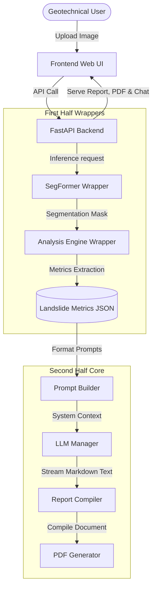

# AI-Powered Landslide Assessment using Multi-Temporal InSAR and Large Language Models

This repository houses the second-half implementation of a research-level geohazard pipeline. It integrates satellite remote sensing outputs (Multi-Temporal InSAR) with cutting-edge Large Language Models (LLMs) to automatically generate structured engineering diagnostics, risk briefs, and professional PDF reports, complete with spatial charts and an interactive geotechnical conversational assistant.

---

## 1. Project Architecture

The architecture connects a pre-trained **SegFormer-B2** segmentation model and a geodetic **Analysis Engine** (First Half - Black Box) with a dynamic **LLM Report Compiler** and a **ReportLab PDF Generator** served via a **FastAPI backend** and a modern **HTML5/CSS3 glassmorphism dashboard**.



---

## 2. Folder Documentation

```
AI_Landslide_Assessment/
├── config/                  # Configuration system
│   └── config.yaml          # Unified system configuration parameters
├── utils/                   # Reusable systems utilities
│   ├── config.py            # Pydantic configuration loader
│   ├── file_manager.py      # Folder trees and lifecycle handlers
│   ├── logger.py            # Structured system logger
│   └── loaders.py           # Image, JSON, and CSV utilities
├── models/                  # SegFormer wrappers
│   └── segformer_wrapper.py # Pre-trained inference interface [INTEGRATION POINT]
├── analysis_engine/         # Analysis wrappers
│   └── analysis_wrapper.py  # Spatial statistics extraction [INTEGRATION POINT]
├── prompts/                 # Prompt engineering
│   ├── templates.yaml       # Geotechnical templates in Jinja2 formats
│   └── builder.py           # Validating and rendering compiler
├── llm/                     # Large Language Model engine
│   ├── base.py              # Unified LLM provider interface
│   ├── manager.py           # Memory buffers and routing factory
│   ├── mock_provider.py     # Local testing CPU mockup provider
│   ├── transformers_provider.py # Local HuggingFace loader
│   ├── ollama_provider.py   # Ollama API adapter client
│   └── vllm_provider.py     # High-throughput vLLM API client
├── report_generator/        # Markdown and HTML diagnostic compilers
│   └── generator.py         # Formats raw telemetry metrics to reports
├── evaluation/              # Quantitative academic evaluation
│   └── evaluator.py         # BLEU, ROUGE, cosine semantic scorers
├── instruction_dataset/     # Fine-tuning data generators
│   └── dataset_generator.py # Converts InSAR JSONs to Alpaca, ShareGPT, OpenAI
├── pdf_generator/           # Publication-quality report generator
│   └── pdf_builder.py       # ReportLab PDF renderer with overlays & tables
├── backend/                 # API Server Layer
│   └── main.py              # FastAPI endpoints, routers, static serving
├── frontend/                # Interactive UI Dashboard
│   ├── index.html           # Structural HTML viewport
│   ├── style.css            # Custom CSS Glassmorphism Stylesheet
│   └── app.js               # Event loop, state machine, streaming calls
├── tests/                   # Complete Unit & Integration tests
│   └── test_components.py   # Automation test suite
├── data/                    # Generated files, metrics, and spatial output maps
│   ├── csv/                 # Landslide CSV datasets
│   ├── json/                # Geotechnical metrics JSON files
│   ├── predictions/         # Binary segmentation masks
│   ├── heatmaps/            # Colored velocity charts
│   ├── overlays/            # Merged spatial satellite overlays
│   └── reports/             # Compiled reports
├── requirements.txt         # Package dependencies
├── app.py                   # Main startup launcher
└── README.md                # General system documentation
```

---

## 3. Installation Guide

### Prerequisites
- Python 3.8 to 3.11.
- CUDA-capable GPU (Optional, recommended for local LLM inference).

### Installation Steps
1. **Clone or locate the workspace:**
   ```bash
   cd c:\Users\ASUS\OneDrive\Documents\AI_Landslide_Assessment
   ```

2. **Establish a virtual environment:**
   ```bash
   python -m venv venv
   source venv/bin/activate  # On Windows: venv\Scripts\activate
   ```

3. **Install Dependencies:**
   ```bash
   pip install -r requirements.txt
   ```

4. **Verify installation by running the test suite:**
   ```bash
   python -m unittest tests/test_components.py
   ```

---

## 4. Developer Guide: Plugging in the First Half

The first-half implementation (SegFormer-B2 and Analysis Engine) must be connected to the wrappers.

### Connecting SegFormer-B2
Open [models/segformer_wrapper.py](file:///c:/Users/ASUS/OneDrive/Documents/AI_Landslide_Assessment/models/segformer_wrapper.py) and modify the `# TODO` regions:
```python
# models/segformer_wrapper.py
def load_model(self) -> None:
    # 1. Import your SegFormer-B2 model class definition
    from your_segformer_library import SegFormerB2
    # 2. Instantiate and load weights
    self.model = SegFormerB2()
    self.model.load_state_dict(torch.load(self.model_path, map_location=self.device))
    self.model.eval()

def predict(self, image_path: str) -> Any:
    # 3. Read image, preprocess tensor, and perform a forward pass
    img_tensor = preprocess_image(image_path)
    with torch.no_grad():
        prediction = self.model(img_tensor)
    return prediction
```

### Connecting the Analysis Engine
Open [analysis_engine/analysis_wrapper.py](file:///c:/Users/ASUS/OneDrive/Documents/AI_Landslide_Assessment/analysis_engine/analysis_wrapper.py) and modify the `# TODO` regions:
```python
# analysis_engine/analysis_wrapper.py
def extract_features(self, prediction: Any) -> Dict[str, Any]:
    # 1. Invoke your feature extraction algorithms using the prediction mask
    from your_analysis_library import compute_slide_metrics
    features = compute_slide_metrics(prediction)
    return features
```

---

## 5. API Documentation

The server exposes swagger documentation at `http://127.0.0.1:8000/docs`.

### Key Endpoints:

1. **`POST /api/upload`**
   - **Purpose**: Uploads raw InSAR images.
   - **Request**: Multipart Form-Data (file).
   - **Response**: `{"image_path": "data/temp/xyz.png", "filename": "input.png"}`

2. **`POST /api/analyze`**
   - **Purpose**: Executes SegFormer wrapper and Analysis Engine wrapper.
   - **Request**: `{"image_path": "data/temp/xyz.png"}`
   - **Response**: Contains persistent map paths and metrics JSON:
     ```json
     {
       "metrics": { "landslide_metadata": { "site_name": "Slope Alpha" }, "displacement_metrics": { "mean_velocity_mm_yr": -42.7 } },
       "prediction_path": "data/predictions/xyz_pred.png",
       "heatmap_path": "data/heatmaps/xyz_heat.png",
       "overlay_path": "data/overlays/xyz_overlay.png"
     }
     ```

3. **`POST /api/report`**
   - **Purpose**: Queries LLM provider. Supports token streaming.
   - **Request**: `{"json_data": {...}, "style": "professional_report"}`
   - **Response**: Text Stream (Event Source) or static JSON text report.

4. **`POST /api/pdf`**
   - **Purpose**: Compiles a publication-quality PDF.
   - **Request**: Includes JSON data, text report contents, and paths of mapping images.
   - **Response**: Binary PDF file stream.

5. **`POST /api/chat`**
   - **Purpose**: Chat query regarding landslide report context. Supports streaming.
   - **Request**: `{"report_content": "...", "user_query": "Is the slope active?", "chat_history": []}`
   - **Response**: Text Stream response.

---

## 6. Deployment Guide

### Running Locally
To launch the developer server locally with mock capabilities:
```bash
python app.py
```
Open `http://127.0.0.1:8000` in your web browser.

### Configuring the LLM Engine
Configure your LLM model inside [config/config.yaml](file:///c:/Users/ASUS/OneDrive/Documents/AI_Landslide_Assessment/config/config.yaml):
- **Mock Mode**: Set `llm.provider: "mock"`.
- **Ollama Mode**: Install Ollama, fetch Qwen (`ollama pull qwen2.5:3b`), and set `llm.provider: "ollama"`.
- **vLLM Mode**: Launch high-throughput API endpoints and set `llm.provider: "vllm"`.
- **HuggingFace Local Mode**: Set `llm.provider: "transformers"`, configure `model_name: "Qwen/Qwen2.5-3B-Instruct"` and `device: "cuda"` to execute on GPU.

### Production Deployment (using Uvicorn)
To run the server in a high-concurrency production configuration:
```bash
uvicorn backend.main:app --host 0.0.0.0 --port 8000 --workers 4 --log-level info
```
